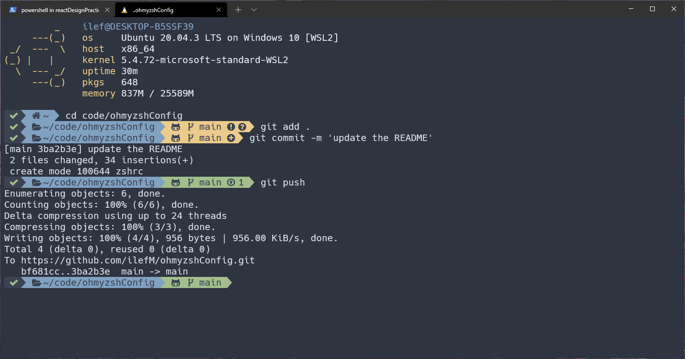

# ohmyzshConfig

ZSH configuration file and how to settup the theme

## Settup zsh on the Windows Terminal with WSL2

### Install Oh-My-ZSH

follow the instruction for the installation in this official [ohmyzsh](https://github.com/ohmyzsh/ohmyzsh) github repository

### Install PowerLevel9k

I personnally find this theme much better than the powerlevel10k...

Clone the repo from the Powerlevel9k [github repository](https://github.com/Powerlevel9k/powerlevel9k) :

- `git clone https://github.com/bhilburn/powerlevel9k.git ~/.oh-my-zsh/custom/themes/powerlevel9k`

### Install the nerd font for the icons

- Github : https://github.com/ryanoasis/nerd-fonts
- I went for the [hack fonts](https://github.com/ryanoasis/nerd-fonts/blob/master/patched-fonts/Hack/Regular/complete/Hack%20Regular%20Nerd%20Font%20Complete.ttf)

### Copy my configuration file

Copy the configuation file `zshrc` into your `.zshrc` config file in your home folder to get the same settings and the look of the screenshot above. You dont need to copy everyting, just the lines 11 to 22 and the last one.

I used this website to get the icons code by importing the file of the font we downloaded above :

- http://mathew-kurian.github.io/CharacterMap/

### Install Pfetch

I installed [pfetch] (https://github.com/dylanaraps/pfetch)

Clone the repository and install it using this command : `sudo install pfetch/pfetch /usr/local/bin/ ls -l /usr/local/bin/pfetch`
